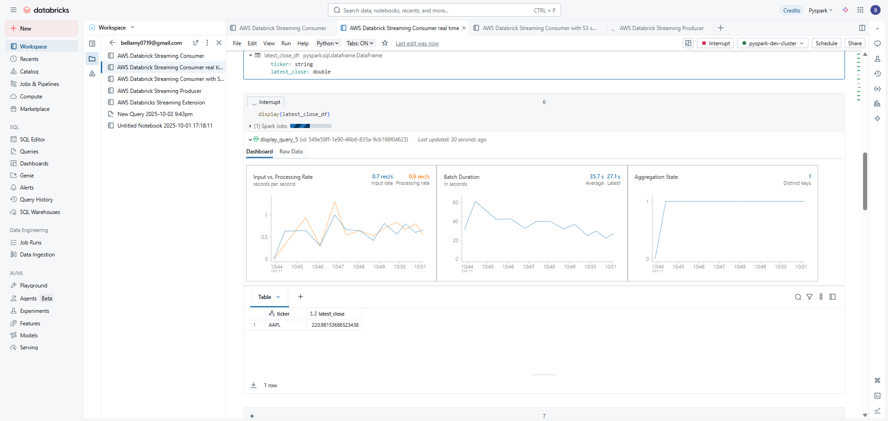
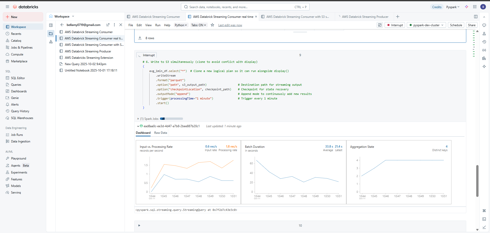
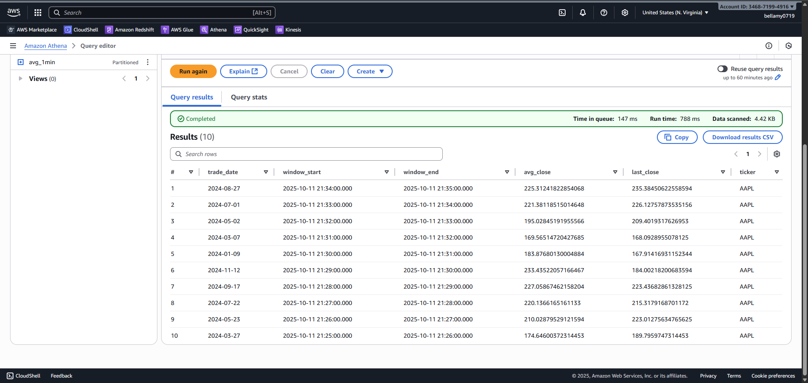
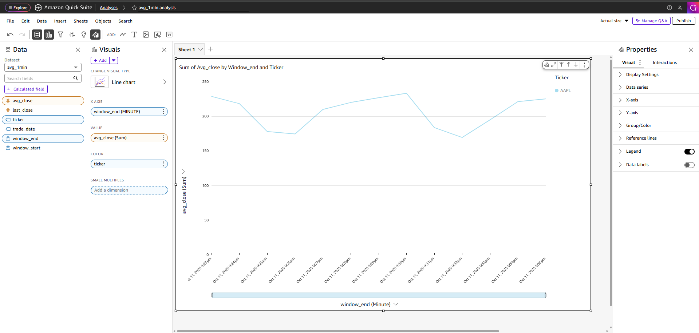

# aws-kinesis-pyspark-streaming-pipeline
### Real-time data streaming pipeline on AWS using Kinesis and PySpark Structured Streaming.
### >  This project extends the batch data lakehouse pipeline:
> [aws-pyspark-data-lakehouse-pipeline](https://github.com/Bellamy0719/aws-pyspark-data-lakehouse-pipeline)

### 🧠 Project Overview

This project simulates real-time stock price streaming using AWS and Databricks.
It reads 2024 historical data from S3, sends it to Kinesis as a live data feed,
processes it in Databricks Structured Streaming, computes rolling metrics,
and stores aggregated results back into S3 for downstream analytics(Glue, Athena, Quicksight)

### ✅ Key Highlights

Real-time streaming with AWS Kinesis
Processing with Databricks Structured Streaming (PySpark)
Partitioned Parquet output to S3
Query layer via AWS Glue + Athena
Dashboard visualization in QuickSight

**Real-Time Stock Data Streaming Architecture**
```

┌───────────────────────────┐
│ S3 Historical Data (2024) │
└────────────┬──────────────┘
             │
             ▼
      Python Producer                           --- Read historical Parquet
     (send to Kinesis)                          --- Send JSON events to Kinesis
             │
             ▼
     Amazon Kinesis Stream  
     (real-time ingestion)
             │
             ▼
   Databricks Notebook (Structured Streaming)
   ├─ Parse JSON from Kinesis                   
   ├─ Transform Data 
   ├─ Compute avg_1min / latest_close            --- real time visualization
   ├─ Display real-time metrics  
   └─ Write results to S3 (Parquet)
             │
             ▼
     AWS S3 Streaming Output                     --- Partitioned Parquet files(ticker, trade date)
   (checkpoint + parquet results)                --- Checkpoints for exactly-once recovery
             │
             ▼
     AWS Athena + Quicksight                    --- Query Parquet results via AWS Glue Catalog
   (SQL query + 1-min rolling average)          --- Visualize 1-min rolling averages using charts
```


### Tech Stack 

| Layer           | Technology                        | Description                    |
| --------------- | --------------------------------- | ------------------------------ |
| Ingestion       | AWS Kinesis                       | Real-time streaming ingestion  |
| Processing      | Databricks Structured Streaming   | PySpark computation            |
| Storage         | AWS S3 (Parquet + Checkpoints)    | Partitioned output             |
| Catalog & Query | AWS Glue + Athena                 | Schema discovery + SQL queries |
| Visualization   | QuickSight + Databricks display() | Real-time dashboards           |


### Components
### Step 1. Producer (Producer - Python → Kinesis)
Purpose:
Simulates real-time stock streaming by reading 2024 Parquet data from S3 and pushing it as JSON messages into AWS Kinesis Stream.
Located in: [notebooks/databricks_streaming_producer.ipynb](notebooks/databricks_streaming_producer.ipynb)
```
kinesis.put_record(
    StreamName="stock_stream",
    Data=json.dumps(record),
    PartitionKey="AAPL"
)
```
Summary:
Starts the entire pipeline to transform historical S3 data into a continuous live stream.


### Step 2. Consumer — Databricks Structured Streaming
Purpose:
Reads data from Kinesis in real time, parses JSON records, converts timestamps, and computes key metrics:
1. Latest Close Price
2. 1-min Rolling Average
Located in: [notebooks/databricks_streaming_consumer.ipynb](notebooks/databricks_streaming_consumer.ipynb)
```
raw_stream_df = (
    spark.readStream
        .format("kinesis")
        .option("streamName", "stock_stream")
        .option("region", "us-east-1")
        .load()
)
```
Summary:
Acts as the real-time processing engine to continuously consumes the Kinesis stream and performs live transformations.


### Step 3. Display — Real-Time Visualization in Databricks
Purpose:
Provides live dashboards of streaming data using the built-in display() function, allowing real-time monitoring of:

1. Latest close price per ticker (latest_close_df)



2. 1-minute rolling average trend (avg_1min_df)
 


Summary:
Real-time visualization directly inside Databricks to confirm the streaming job is active and data is updating continuously.


### Step 4. Streaming Sink — Write to AWS S3 (Parquet + Checkpoints)
Purpose:
Writes processed streaming results to S3 in Parquet format, partitioned by ticker and trade_date,
with checkpointing for exactly-once recovery.

```
(
    avg_1min_df
        .writeStream
        .format("parquet")
        .option("path", s3_output_path)
        .option("checkpointLocation", checkpoint_path)
        .outputMode("append")
        .partitionBy("ticker", "trade_date")
        .trigger(processingTime="1 minute")
        .start()
)
```

Summary:
Streams results to AWS S3 for downstream analytics for fault-tolerant and partitioned for Athena/QuickSight queries.


### Step 5. Analytics Layer — Athena + QuickSight
Purpose:
Queries and visualizes the aggregated results stored in S3.
Provides both tabular and trend-based analytics (e.g., 1-min average price).

```
SELECT *
FROM stock_streaming_database.avg_1min
ORDER BY window_end DESC
LIMIT 10;
```
Athena Query Result


QuickSight Dashboard

Summary:
Final presentation layer to enable SQL-based exploration and rich visual dashboards.


### Summary
| Step | Component       | Description                                                 |
| ---- | --------------- | ----------------------------------------------------------- |
| 1️⃣  | Producer        | Sends historical data → Kinesis (simulated real-time feed)  |
| 2️⃣  | Consumer        | Reads & processes stream in Databricks Structured Streaming |
| 3️⃣  | Display         | Visualizes live metrics directly in Databricks              |
| 4️⃣  | Streaming Sink  | Writes processed data to S3 (Parquet + checkpoints)         |
| 5️⃣  | Analytics Layer | Queries results via Athena, visualizes in QuickSight        |

### Why These Tools
AWS Kinesis — provides a fully managed, scalable real-time data stream, perfect for simulating live stock market data.

Databricks Structured Streaming (PySpark) — allows unified batch + stream processing with fault tolerance and checkpointing.

AWS S3 — serves as a central, durable data lake for storing both raw and aggregated results.

AWS Glue + Athena — automate schema discovery and enable serverless SQL querying on streaming outputs.

AWS QuickSight — provides lightweight, cloud-native visualization for dashboards and real-time analytics.

### Project Structure
```
aws-databricks-realtime-stock-streaming/
│
├── notebooks/
│   ├── databricks_streaming_consumer.ipynb
│   ├── databricks_streaming_producer.ipynb
│   ├── databrick_consumer_avg_1min.png
│   ├── databrick_consumer_lastest_close.png
│   ├── databrick_consumer_writeto_s3.png
│   └── databrick_producer_logging.png
│
├── assets/
│   ├── athena_query.png
│   ├── athena_query_result.png
│   ├── kinesis_console.png
│   ├── quicksight_dashboard.png
│   ├── table_schema.png
│
├── LICENSE
└── README.md
```

